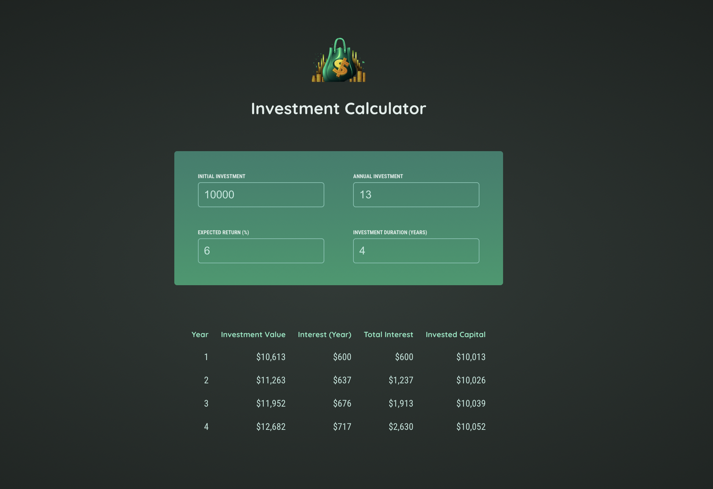

# Investment Calculator React

A simple React investment calculator app for practicing React essentials. Input your investment details and see year-by-year projections of your returns.

## Features

- **Real-time calculations** - Get investment projections as you type
- **Year-by-year breakdown** - See detailed results for each year including investment value, interest earned, and total interest
- **Clean UI** - Simple and intuitive interface with form inputs and results table

## Screenshot



## Tech Stack

- React 18
- Vite
- CSS

## Getting Started

```bash
npm install
npm run dev
```

## Project Overview

This project demonstrates React fundamentals including state management with `useState`, component composition, and form handling. Perfect for learning React essentials!